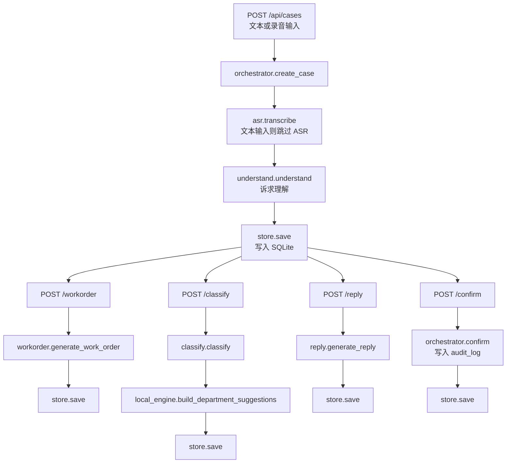

# 现有流程与数据源映射说明

## 目的

本文档记录 LangChain、LangGraph、Chroma RAG 改造前，`12345Agent-New` 当前业务流程、服务模块、API 接口和数据源之间的对应关系。后续改造时，应优先保持 API 对外契约不变，把内部实现逐步替换为 LangChain Runnable、LangGraph 节点和 Chroma 检索器。

## 当前主流程

## API 与业务模块映射

| API | 当前入口 | 当前内部调用 | 当前输出 |
| --- | --- | --- | --- |
| `GET /health` | `app/main.py` | 读取 `LLM_AVAILABLE` | 服务状态与模型可用性 |
| `GET /api/meta` | `app/main.py` | 读取 `LLM_AVAILABLE` | `engine_mode` 为 `llm` 或 `local-engine` |
| `POST /api/cases` | `app/api/cases.py` | `orchestrator.create_case` | `CaseState`，包含 `understanding` |
| `GET /api/cases` | `app/api/cases.py` | `store.list` | 案件列表 |
| `GET /api/cases/{case_id}` | `app/api/cases.py` | `store.get` | 案件详情 |
| `POST /api/cases/{case_id}/workorder` | `app/api/cases.py` | `orchestrator.run_workorder` | `WorkOrder` |
| `POST /api/cases/{case_id}/classify` | `app/api/cases.py` | `orchestrator.run_classify` | `ClassificationResult` |
| `POST /api/cases/{case_id}/reply` | `app/api/cases.py` | `orchestrator.run_reply` | `ReplyResult` |
| `POST /api/cases/{case_id}/confirm` | `app/api/cases.py` | `orchestrator.confirm` | 更新后的 `CaseState` |
| `POST /api/cases/{case_id}/handling` | `app/api/cases.py` | `orchestrator.record_handling` | 更新后的 `CaseState` |
| `GET /api/samples` | `app/api/samples.py` | `loaders.load_mock_requests`、`loaders.load_historical_cases` | 文本样例与录音样例 |
| `GET /api/history?q=` | `app/api/history.py` | `history.find_similar` | 相似历史案例 |

## 服务模块与数据源映射

| 业务阶段 | 当前模块 | 使用的数据源 | 当前逻辑 | 后续改造对接点 |
| --- | --- | --- | --- | --- |
| 录音转写 | `app/services/asr.py` | `data/processed/work_orders.json`、上传录音、科大讯飞配置 | 优先按录音文件名匹配历史工单；配置完整时调用讯飞 ASR；失败后模拟转写 | 作为 LangGraph 的 `prepare_input_node` |
| 诉求理解 | `app/services/understand.py` | 输入文本、LLM 配置、本地规则 | 有 LLM 时调用模型抽取结构化要素；失败后走 `local_engine.understand` | 改为 LangChain understand chain |
| 事项分类 | `app/services/classify.py` | `category_catalog.json`、`department_rules.json`、输入文本 | 有 LLM 时判断 12 类；失败后关键词打分；部门推荐来自本地规则 | 接入 Chroma 分类目录和部门职责检索 |
| 工单生成 | `app/services/workorder.py` | 输入文本、理解结果、分类结果 | 有 LLM 时生成 JSON；失败后模板化工单 | 接入相似历史工单 RAG 上下文 |
| 回复辅助 | `app/services/reply.py` | 理解结果、分类结果、部门建议 | 有 LLM 时生成受理提示和回复；失败后模板化回复 | 接入历史答复、政策文件、回复模板 RAG |
| 本地兜底 | `app/services/local_engine.py` | 分类目录、部门规则、历史工单 | 关键词分类、正则抽取、模板生成 | 保留为 LangChain/LangGraph 节点失败后的 fallback |
| 数据加载 | `app/data/loaders.py` | `data/categories`、`data/departments`、`data/processed`、`data/mock` | 统一读取 JSON 和历史工单 | 可复用为 RAG Document 构建入口 |
| 状态持久化 | `app/workflow/store.py` | `storage/cases.db` | SQLite 保存完整 `CaseState` JSON | 保留业务结果存储；另加 LangGraph checkpoint |

## 当前数据目录映射

| 目录或文件 | 当前用途 | 后续 RAG 用途 |
| --- | --- | --- |
| `backend/data/raw/official_work_orders/` | 保存赛事官方 Excel 和录音原始副本 | 原始数据层，不直接进入检索 |
| `backend/data/processed/work_orders.json` | 历史工单标准化结果、样例录音文件名匹配来源 | 建立 `historical_cases` collection |
| `backend/data/categories/category_catalog.json` | 12 类一级事项分类 | 建立 `category_catalog` collection |
| `backend/data/departments/department_rules.json` | 示例部门职责和关键词规则 | 建立 `department_rules` collection |
| `backend/data/mock/mock_requests.json` | 演示输入样例 | 可作为 few-shot 示例或测试输入 |
| `backend/data/mock/expected_results.json` | 期望结果样例 | 可作为测试断言或评估集 |
| `backend/storage/cases.db` | 案件运行结果持久化 | 继续保存业务结果 |
| `backend/storage/chroma/` | 当前尚未正式建立 | 建议作为 Chroma 本地持久化目录 |

## 改造边界

第 0 步不改变对外 API，不改变前端调用方式，不调整业务字段含义。后续 LangChain、LangGraph 和 RAG 改造应当以当前表格为基线：

- 外部接口尽量保持原路径。
- 返回结构优先兼容现有 Pydantic 模型。
- 旧的 `local_engine` 保留为课堂演示和异常兜底。
- 新增的检索依据、流程轨迹、质量检查结果可先写入内部 state，再逐步暴露给前端。

