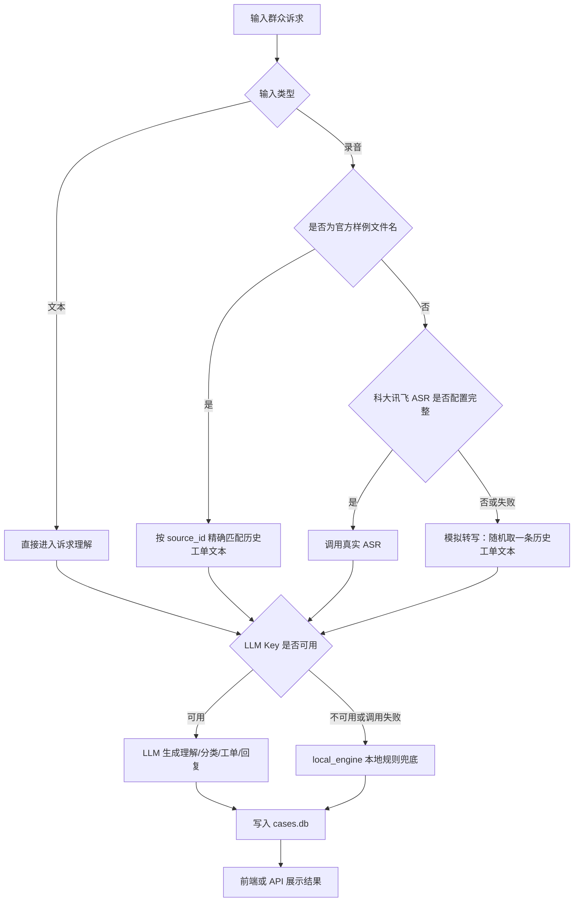

# 无 LLM Key 演示兜底路径

## 目的

本项目面向一天内线下带教，需要保证在没有外部模型 Key、没有真实 ASR 服务、网络不稳定的情况下，仍然可以完整演示 12345 热线工单智能体闭环。

## 兜底原则

系统当前采用“优先真实能力，失败自动降级”的方式：



## LLM 兜底路径

配置位置：

```text
12345Agent-New/backend/.env
```

判断逻辑：

- `LLM_API_KEY` 为空或为 `replace_me` 时，`LLM_AVAILABLE=False`。
- `/api/meta` 返回 `engine_mode=local-engine`。
- 理解、分类、工单、回复阶段自动使用 `app/services/local_engine.py`。

本地兜底能力：

- `understand`：用正则抽取时间、地点、涉及对象、事件、诉求，并识别紧急和重复反映。
- `classify`：用 12 类关键词字典打分。
- `build_department_suggestions`：根据 `department_rules.json` 推荐主责和协办单位。
- `work_order`：按模板生成标题、摘要、正文和关键要素。
- `reply`：按模板生成受理提示、办理建议、预回复和回访话术。

## ASR 兜底路径

当前录音处理顺序：

1. 如果上传录音文件名能匹配历史工单 `source_id`，直接返回该工单的 `request_content`，并标记 `transcript_source=sample-match`。
2. 如果科大讯飞 ASR 配置完整且上传了音频字节，调用真实 ASR，并标记 `transcript_source=kdxf-asr`。
3. 如果以上方式不可用或失败，则随机取一条历史工单文本作为模拟转写，并标记 `transcript_source=simulated`。

这条兜底路径保证了课堂上即使没有真实 ASR 账号，也能展示“录音输入进入工单流程”的效果。

## 课堂演示建议

### 演示 1：纯文本输入

使用文本：

```text
南陵县某理发店没有公示服务价格，也没有在醒目位置悬挂营业执照，希望有关部门核查。
```

预期效果：

- 可以创建案件。
- 能抽取诉求要素。
- 分类为“市场监管”。
- 推荐承办单位。
- 生成工单和回复。
- 可以人工确认。

### 演示 2：官方样例录音文件名匹配

使用官方样例录音文件名，例如：

```text
260715111208005.mp3
```

预期效果：

- 系统按文件名匹配历史工单。
- `transcript_source=sample-match`。
- 不需要真实 ASR 服务。

### 演示 3：未知录音模拟转写

上传任意未知录音文件名。

预期效果：

- 系统返回模拟转写文本。
- `transcript_source=simulated`。
- 后续理解、分类、工单、回复流程仍可继续。

## 与后续 LangChain / LangGraph / RAG 改造的关系

后续改造时，这套兜底路径应继续保留：

- LangChain chain 调用失败时，降级到 `local_engine`。
- LangGraph 节点执行失败时，在 state 中记录错误并走可控 fallback。
- Chroma 索引不存在或检索为空时，仍可使用本地分类目录和部门规则。
- 前端展示时继续显示 `source` 和 `transcript_source`，让工作人员知道结果来自真实模型、样例匹配还是本地兜底。

