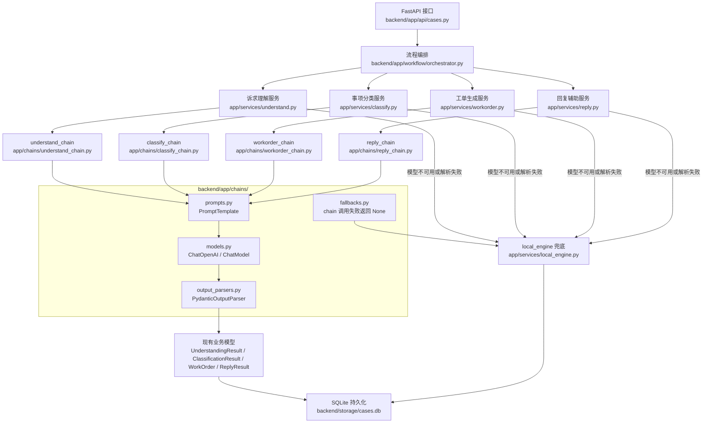

# 第 1 步改造结果：LLM 调用标准化为 LangChain Runnable

## 改造目标

本阶段将原先散落在 `understand.py`、`classify.py`、`workorder.py`、`reply.py` 中的直接 LLM 调用，整理为 `backend/app/chains/` 下的 LangChain Runnable/Chain 封装。对外 API 和现有返回结构保持不变。

## 新增目录

```text
backend/app/chains/
```

## 项目目录与调用流程



## 新增文件

| 文件 | 作用 |
| --- | --- |
| `app/chains/models.py` | 统一初始化 LangChain `ChatOpenAI`，兼容 OpenAI 协议模型 |
| `app/chains/prompts.py` | 集中管理诉求理解、分类、工单、回复 PromptTemplate |
| `app/chains/output_parsers.py` | 定义 LLM 阶段输出用的 Pydantic 结构化模型 |
| `app/chains/fallbacks.py` | 封装 chain 调用失败时返回 `None` 的兜底工具 |
| `app/chains/understand_chain.py` | 诉求理解 Runnable |
| `app/chains/classify_chain.py` | 事项分类 Runnable |
| `app/chains/workorder_chain.py` | 工单生成 Runnable |
| `app/chains/reply_chain.py` | 回复辅助 Runnable |

## 改造后的调用方式

服务层现在不再自己拼 prompt、调用 OpenAI SDK、手动解析 JSON，而是调用对应 chain：

```python
payload = invoke_understand_chain(text)
```

如果 chain 返回结果，则转换为现有业务模型并标记 `source="llm"`。如果模型不可用、调用失败或解析失败，则继续走原有 `local_engine` 兜底。

## 已改造服务

| 服务文件 | 改造内容 |
| --- | --- |
| `app/services/understand.py` | 改为调用 `invoke_understand_chain` |
| `app/services/classify.py` | 改为调用 `invoke_classify_chain` |
| `app/services/workorder.py` | 改为调用 `invoke_workorder_chain` |
| `app/services/reply.py` | 改为调用 `invoke_reply_chain` |
| `app/services/llm.py` | 保留为旧工具兼容层，内部改为 LangChain `ChatPromptTemplate | ChatModel | StrOutputParser` |

## 本阶段暂未引入的能力

- Memory：当前项目主线是案件状态流转，状态仍由 `CaseState` 和后续 LangGraph State 管理。
- ToolUse：历史案例、部门规则和政策检索会在下一阶段 Chroma RAG 接入后再封装。
- AgentExecutor：12345 工单流程是明确的阶段式流程，后续优先使用 LangGraph 显式编排。

## 验证结果

语法检查：

```text
python -m compileall app -q
通过
```

现有测试：

```text
14 passed in 5.37s
```

## 当前结论

第 1 步已完成基础改造：LLM 调用已经标准化为 LangChain Runnable/Chain，现有 API 和测试基线保持稳定。下一步可以在此基础上接入 Chroma RAG，将分类目录、部门规则和历史工单作为检索上下文传入这些 chain。

