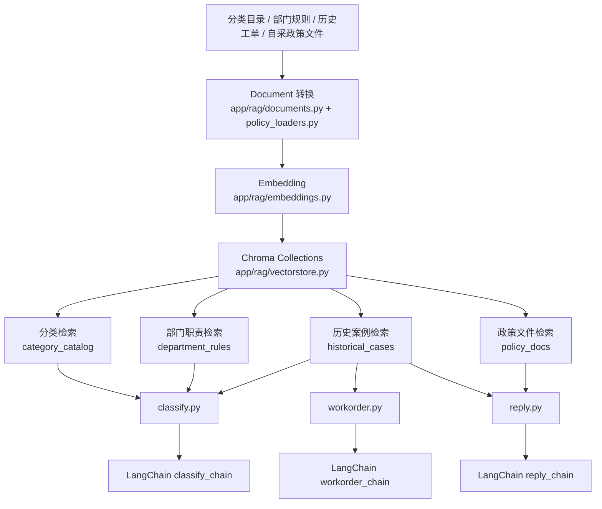
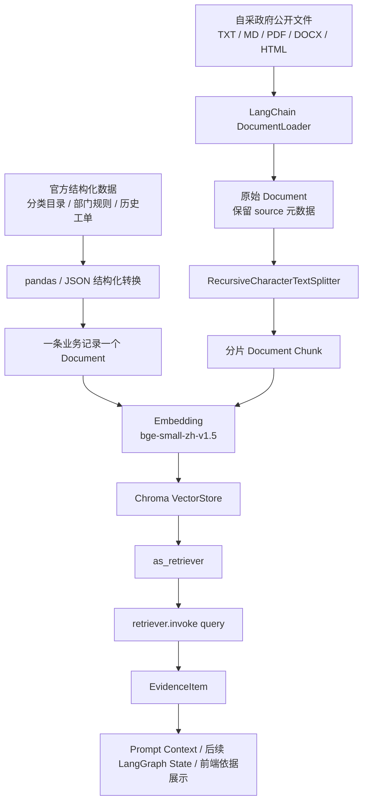

# 第 2 步改造结果：RAG 文档模型与 Chroma 索引

## 改造目标

本阶段为项目新增 RAG 基础设施：把分类目录、部门职责、历史工单转换为 LangChain Document，使用本地 `bge-small-zh-v1.5` embedding 模型写入 Chroma，并预留自采政府公开文件进入向量数据库的规范入口。

## 新增 RAG 模块

```text
backend/app/rag/
  __init__.py
  schemas.py
  embeddings.py
  documents.py
  policy_loaders.py
  splitter.py
  vectorstore.py
  retrievers.py
```

| 文件 | 作用 |
| --- | --- |
| `schemas.py` | 定义 RAG 检索结果、自采文件元数据、校验问题模型 |
| `embeddings.py` | 封装本地 `sentence-transformers` embedding 模型 |
| `documents.py` | 将分类目录、部门规则、历史工单转换为 LangChain Document |
| `policy_loaders.py` | 使用 LangChain DocumentLoader 加载自采政府公开文件，并保留原始文档元数据 |
| `splitter.py` | 使用 LangChain `RecursiveCharacterTextSplitter` 统一处理政策类长文档分片 |
| `vectorstore.py` | 统一管理 Chroma collection 创建、重建、计数，并暴露 `as_retriever()` 检索器入口 |
| `retrievers.py` | 使用 LangChain Retriever 召回文档，并标准化为 `EvidenceItem` |

## 新增脚本

```text
backend/scripts/build_chroma_index.py
backend/scripts/inspect_chroma_index.py
backend/scripts/validate_policy_sources.py
```

常用命令：

```powershell
python scripts/build_chroma_index.py --source official
python scripts/build_chroma_index.py --source policies
python scripts/build_chroma_index.py --source all
python scripts/inspect_chroma_index.py --query "理发店没有公示价格和营业执照" --collection historical_cases --top-k 2
python scripts/validate_policy_sources.py
```

## 当前 Chroma Collections

索引路径：

```text
backend/storage/chroma/
```

当前构建结果：

| Collection | 数据来源 | 当前数量 |
| --- | --- | --- |
| `category_catalog` | `data/categories/category_catalog.json` | 12 |
| `department_rules` | `data/departments/department_rules.json` | 12 |
| `historical_cases` | `data/processed/work_orders.json` | 18 |
| `policy_docs` | `data/raw/public_policies/` | 0 |

## 自采政府文件入口

新增目录：

```text
backend/data/raw/public_policies/
```

该目录用于放置后续自行收集的政府部门公开政策、办事指南、权责清单、FAQ 等文件。每个文件需要配套同名 `.meta.json`，用于记录来源、发布单位、采集时间和使用范围。

示例：

```text
backend/data/raw/public_policies/housing/
  芜湖市物业管理办法.pdf
  芜湖市物业管理办法.meta.json
```

## 改造后的内部调用流程



## 服务层接入情况

| 服务文件 | RAG 接入内容 |
| --- | --- |
| `app/services/classify.py` | LLM 可用时检索分类目录、部门职责、历史案例，作为分类 chain 上下文 |
| `app/services/workorder.py` | LLM 可用时检索相似历史工单，作为工单生成 chain 上下文 |
| `app/services/reply.py` | LLM 可用时检索相似历史工单和政策文件，作为回复辅助 chain 上下文 |

无 LLM Key 时，服务层继续直接走 `local_engine`，保证课堂现场可以离线跑通原有演示闭环。

## 本轮增强改造清单

| 改造项 | 当前处理结果 | 说明 |
| --- | --- | --- |
| LangChain DocumentLoader | 已接入自采政府文件链路 | `policy_loaders.py` 中按格式使用 `TextLoader`、`PyPDFLoader`、`Docx2txtLoader`、`BSHTMLLoader`；官方 Excel 工单仍使用 `pandas` 结构化读取更合适 |
| RecursiveCharacterTextSplitter | 已新增 | `splitter.py` 使用 `RecursiveCharacterTextSplitter`，配置了中文标点分隔符，主要用于政策、指南、网页、Word、PDF 等长文档 |
| 官方结构化数据 Document 策略 | 保持一条业务记录一个 Document | 分类目录、部门职责、历史工单本身是短结构化记录，保留完整业务上下文，暂不强制分片 |
| 原始文档与分片文档区分 | 已接入自采政策链路 | 自采文件先由 Loader 生成原始 Document，再由 Splitter 生成 chunk Document；chunk metadata 中保留 `original_doc_id`、`chunk_index`、`chunk_count`、`is_chunk` |
| LangChain Retriever | 已接入 | `vectorstore.py` 暴露 `get_retriever()`，内部使用 Chroma `as_retriever()`；`retrievers.py` 使用 `retriever.invoke(query)` 召回 |
| Evidence / Citation 标准化 | 已接入 | 新增 `EvidenceItem`，字段包括 `collection`、`doc_type`、`source_name`、`source_url`、`content`、`score`、`metadata` |
| LangGraph RAG 字段预留 | 已接入 schema | 新增 `RagWorkflowContext`，包含 `retrieved_contexts` 和 `rag_status`，后续可直接放入 LangGraph state |
| Chroma 适配 | 已保持 | collection 仍为 `category_catalog`、`department_rules`、`historical_cases`、`policy_docs`，持久化路径仍为 `backend/storage/chroma/` |

## 标准化后的 RAG 链路



## 新增依赖

本轮增强为了使用 LangChain 官方/社区文档加载器和文本分片器，已补充到 `backend/requirements.txt`：

```text
langchain-community
langchain-text-splitters
pypdf
docx2txt
beautifulsoup4
```

说明：当前 `langchain-community` 在测试时会出现维护迁移提示，但不影响运行。后续如果 LangChain 官方拆出独立 loader 包，可以再按新版推荐替换。

## 验证结果

索引构建：

```text
Embedding 模型：backend/storage/models/bge-small-zh-v1.5
写入结果：
- category_catalog: 12
- department_rules: 12
- historical_cases: 18

当前 collection 数量：
- category_catalog: 12
- department_rules: 12
- historical_cases: 18
- policy_docs: 0
```

检索验证：

```text
query: 理发店没有公示价格和营业执照
collection: historical_cases
top result: 市场监管 - 关于汪女士反映南陵县籍山镇和顺紫悦府对面立新理发店收费不合理的问题
```

测试结果：

```text
19 passed in 18.61s
```

最终复验：

```text
python -m compileall app scripts -q
通过

pytest tests -q
19 passed in 18.61s
```

注意：测试中出现 1 条 `langchain-community` 维护迁移提示，不影响当前功能。

## 当前结论

第 2 步及本轮增强改造已完成：项目已经具备更标准的 LangChain RAG 链路。官方分类目录、部门职责和历史工单已入库；自采政府公开文件已具备 LangChain Loader、RecursiveCharacterTextSplitter、Chroma、Retriever、Evidence 的完整入口。下一步可以把 `EvidenceItem` 和 `RagWorkflowContext` 接入 LangGraph 的 `retrieve_context` 节点，进入第 3 步状态图改造。

