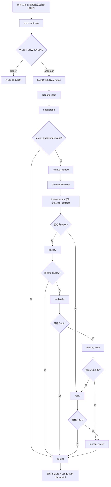

# 第 3 步改造结果：LangGraph 状态图编排

## 改造目标

在不改变现有前端交互和既有 `/api/cases` 分阶段接口的前提下，将案件处理的内部编排升级为 LangGraph `StateGraph`。工作流以 `case_id` 作为 LangGraph `thread_id`，将案件业务状态、RAG 召回证据、质量检查结果和节点轨迹统一保存。

## 新增模块

```text
backend/app/graph/
  __init__.py
  state.py
  nodes.py
  edges.py
  checkpoints.py
  workflow.py
```

| 文件 | 作用 |
| --- | --- |
| `state.py` | 定义可 JSON 序列化的 `CaseGraphState`，并负责与既有 `CaseState` 双向转换 |
| `nodes.py` | 定义输入准备、理解、RAG 召回、分类、工单、质量检查、回复、人工复核、持久化节点 |
| `edges.py` | 定义按 `target_stage`、质量标记和人工复核状态进行的条件路由 |
| `checkpoints.py` | 使用 `SqliteSaver` 将 LangGraph checkpoint 持久化到本地 SQLite |
| `workflow.py` | 组装 `StateGraph`，并提供 `run_case_graph()` 统一调用入口 |

Checkpoint 文件：

```text
backend/storage/langgraph_checkpoints.sqlite
```

## 改造后的流程图



## State 与 RAG 的结合

`CaseGraphState` 在原有案件字段外，新增了以下流程字段：

| 字段 | 用途 |
| --- | --- |
| `retrieved_contexts` | 按 `classification`、`workorder`、`reply` 分组保存 Chroma 召回的 `EvidenceItem` |
| `rag_status` | 保存各用途的召回数量和状态，便于诊断索引或召回问题 |
| `quality_flags` | 记录信息不全、紧急、分类置信度不足等质量标记 |
| `human_review_required` | 标记是否应进入人工复核 |
| `next_action` | 当前图流程建议的下一步动作 |
| `graph_trace` | 记录已执行的图节点，供教学演示、排错和后续前端展示 |

为了适配 SQLite checkpoint，`EvidenceItem` 以字典形式写入图状态；分类、工单、回复节点消费前会还原为 `EvidenceItem`，再生成 LangChain Prompt 上下文。因而来源、URL、分数和 metadata 等证据字段会随案件保留，不只是临时拼接到 Prompt。

## 节点与既有服务的对接

| LangGraph 节点 | 调用或数据来源 | 结果 |
| --- | --- | --- |
| `prepare_input` | 文本输入或既有 ASR 服务 | 统一得到纯文本转录，不将音频二进制写入 checkpoint |
| `understand` | `services/understand.py` | `UnderstandingResult` |
| `retrieve_context` | Chroma `Retriever.invoke()` | 分用途 `EvidenceItem` 证据集合 |
| `classify` | `services/classify.py` + 分类证据 | `ClassificationResult` |
| `workorder` | `services/workorder.py` + 历史工单证据 | `WorkOrder` |
| `quality_check` | 图内规则 | 风险标记与人工复核判断 |
| `reply` | `services/reply.py` + 政策/历史案例证据 | `ReplyResult` |
| `human_review` | 图内节点 | 留下待人工处理的审计记录，不自动确认案件 |
| `persist` | `workflow/store.py` | 回写既有案件 SQLite，并保留完整节点轨迹 |

## 路由规则

补充：完整流程在质量检查通过后，会先进入 retrieve_reply_context；该节点使用已完成分类的类别作为 Chroma 元数据筛选条件，再把政策和历史案例证据交给回复节点。

- `target_stage=understand`：只完成输入准备和诉求理解，然后持久化。
- `target_stage=classify`：理解后召回分类证据、执行分类，然后持久化。
- `target_stage=workorder`：召回分类和历史工单证据，依次完成分类、工单，然后持久化。
- `target_stage=reply`：召回回复所需证据，生成回复，然后持久化。
- `target_stage=full`：完整运行至质量检查；紧急、信息不全或分类需要人工研判时直接进入 `human_review`，其他案件先生成回复后也会进入人工复核节点，作为演示用的“自动建议 + 人工确认”闭环。

## 兼容与启用方式

原有 API 路径、请求体和返回主体均保持可用：

```text
POST /api/cases
POST /api/cases/{case_id}/classify
POST /api/cases/{case_id}/workorder
POST /api/cases/{case_id}/reply
POST /api/cases/{case_id}/confirm
POST /api/cases/{case_id}/handling
```

默认配置仍为 `legacy`，以便课堂现场可快速回退。要启用本阶段图工作流，在 `backend/.env` 中设置：

```dotenv
WORKFLOW_ENGINE=langgraph
```

可通过 `GET /api/meta` 查看实际启用的 `workflow_engine`。前端不需要因此修改交互流程；接口返回的案件详情会额外包含 `retrieved_contexts`、`rag_status`、`quality_flags`、`human_review_required`、`next_action` 和 `graph_trace`，后续可选择性展示。

## 依赖

第 3 步依赖已经列入 `backend/requirements.txt`：

```text
langgraph
langgraph-checkpoint-sqlite
```

无需新增独立服务；checkpoint 与案件库均使用本地 SQLite，RAG 继续使用本地 Chroma。

## 验证结果

新增测试文件：

```text
backend/tests/test_langgraph_workflow.py
```

覆盖内容：

- 高置信案件会在分类后按类别检索回复依据，再生成自动回复。

- LangGraph 模式下既有创建、分类、工单 API 仍可调用。
- Chroma 检索结果写入 `retrieved_contexts` 和 `rag_status`，并保留节点轨迹。
- 紧急案件的完整图流程会标记 `urgent`，跳过自动回复并路由到 `human_review`。
- 回写案件 SQLite 后仍可读取人工复核状态与图状态。

最终复验：

```text
python -m compileall app scripts -q
通过

pytest tests -q
21 passed, 1 warning in 17.30s
```

其中 1 条 warning 来自 `langchain-community` 的维护迁移提示，不影响本阶段功能。

## 当前结论

第 3 步已经完成：项目具备可切换的 LangGraph 编排、SQLite checkpoint、RAG 证据状态传递、条件路由和人工复核节点。现有用户侧流程不被强制改变；后续可在第 4 步把 `full` 图流程显式暴露为演示接口，或由前端将证据和人工复核状态可视化。


